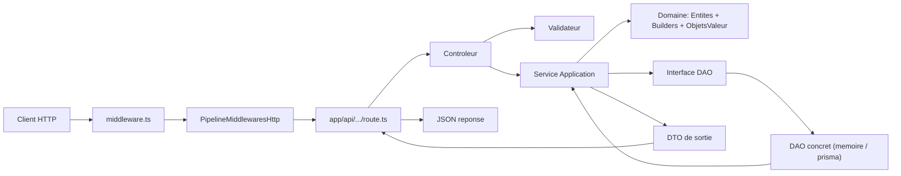
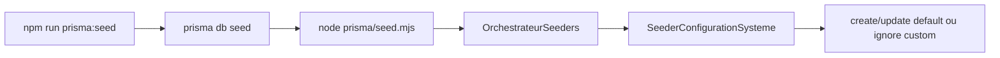
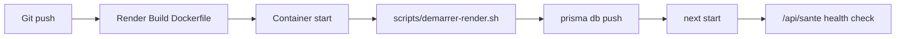
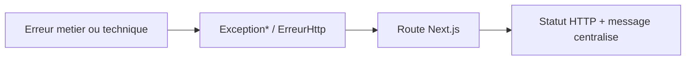
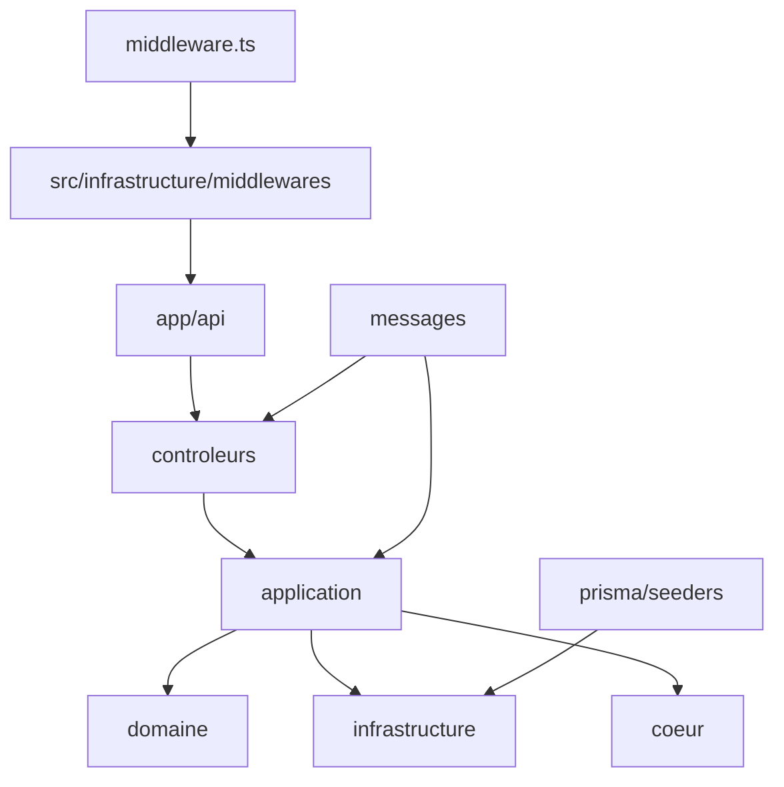

# Captures Dossiers et Sous-Dossiers (Version Texte)

Ce document contient des captures textuelles de la structure reelle du projet.

## Capture 01 - Vue globale (niveau 2)

```text
.
├── .dockerignore
├── .env
├── .gitignore
├── Dockerfile
├── README.md
├── app
│   ├── api
│   ├── docs
│   ├── documentation
│   └── layout.tsx
├── docs
│   ├── CAPTURES_DOSSIERS_ET_SOUS_DOSSIERS.md
│   ├── CHARTE_DOCUMENTATION_OBLIGATOIRE.md
│   ├── CONCEPTS_BACKEND_POO_SOLID.md
│   ├── DEPLOIEMENT_RENDER_DOCKER.md
│   ├── DOCUMENTATION_FICHIER_PAR_FICHIER.md
│   ├── GUIDE_DOSSIER_PAR_DOSSIER.md
│   ├── GUIDE_MAITRE_ARCHITECTURE_REUTILISABLE.md
│   ├── INDEX_DOCUMENTATION_COMPLETE.md
│   ├── MODELE_CONFIGURATION_SYSTEME.md
│   ├── REFERENCE_FICHIER_PAR_FICHIER.md
│   └── SEEDERS_GUIDE_COMPLET.md
├── eslint.config.mjs
├── middleware.ts
├── next-env.d.ts
├── next.config.ts
├── package-lock.json
├── package.json
├── prisma
│   ├── schema.prisma
│   ├── seed.mjs
│   └── seeders
├── render.yaml
├── scripts
│   └── demarrer-render.sh
├── src
│   ├── application
│   ├── coeur
│   ├── controleurs
│   ├── docs
│   ├── documentation
│   ├── domaine
│   ├── infrastructure
│   ├── messages
│   └── tests
└── tsconfig.json

19 directories, 28 files
```

## Capture 02 - Vue detaillee de src (niveau 4)

```text
src
├── application
│   ├── dtos
│   │   ├── DtoAdmin.ts
│   │   ├── DtoBrandingAdmin.ts
│   │   ├── DtoCaution.ts
│   │   ├── DtoClient.ts
│   │   ├── DtoConfigurationPlateforme.ts
│   │   ├── DtoCreationUtilisateur.ts
│   │   ├── DtoDemandeAdmin.ts
│   │   ├── DtoDocument.ts
│   │   ├── DtoEntreprise.ts
│   │   ├── DtoErreurImport.ts
│   │   ├── DtoExecutionImport.ts
│   │   ├── DtoIpBloquee.ts
│   │   ├── DtoItemTravail.ts
│   │   ├── DtoJournalAudit.ts
│   │   ├── DtoLocation.ts
│   │   ├── DtoNotification.ts
│   │   ├── DtoPaiementAbonnementAdmin.ts
│   │   ├── DtoPaiementCaution.ts
│   │   ├── DtoPaiementMensuel.ts
│   │   ├── DtoPermissionsAdmin.ts
│   │   ├── DtoReponseUtilisateur.ts
│   │   ├── DtoStatutAbonnementAdmin.ts
│   │   ├── DtoTransactionPaiement.ts
│   │   ├── DtoUtilisateur.ts
│   │   └── index.ts
│   ├── exceptions
│   │   ├── ExceptionApplication.ts
│   │   ├── ExceptionCasUsage.ts
│   │   ├── ExceptionValidationApplication.ts
│   │   └── index.ts
│   ├── fabriques
│   │   └── FabriqueUtilisateur.ts
│   ├── mappers
│   │   └── MappeurUtilisateur.ts
│   ├── services
│   │   └── ServiceSante.ts
│   └── validateurs
│       └── ValidateurUtilisateur.ts
├── coeur
│   ├── configuration
│   │   └── ConfigurationApplication.ts
│   ├── conteneur
│   │   └── ConteneurDependances.ts
│   ├── erreurs
│   │   └── ErreurHttp.ts
│   ├── exceptions
│   │   ├── ExceptionBase.ts
│   │   ├── ExceptionConfiguration.ts
│   │   ├── ExceptionHttp.ts
│   │   ├── ExceptionTechnique.ts
│   │   └── index.ts
│   └── interfaces
│       ├── InterfaceClientBaseDeDonnees.ts
│       └── InterfaceValidateurEntree.ts
├── controleurs
│   └── ControleurSante.ts
├── docs
│   └── README.ts
├── documentation
│   └── GenerateurSwagger.ts
├── domaine
│   ├── builders
│   │   ├── BuilderAbstrait.ts
│   │   ├── BuilderEntiteAdmin.ts
│   │   ├── BuilderEntiteBrandingAdmin.ts
│   │   ├── BuilderEntiteCaution.ts
│   │   ├── BuilderEntiteClient.ts
│   │   ├── BuilderEntiteConfigurationPlateforme.ts
│   │   ├── BuilderEntiteDemandeAdmin.ts
│   │   ├── BuilderEntiteDocument.ts
│   │   ├── BuilderEntiteEntreprise.ts
│   │   ├── BuilderEntiteErreurImport.ts
│   │   ├── BuilderEntiteExecutionImport.ts
│   │   ├── BuilderEntiteIpBloquee.ts
│   │   ├── BuilderEntiteItemTravail.ts
│   │   ├── BuilderEntiteJournalAudit.ts
│   │   ├── BuilderEntiteLocation.ts
│   │   ├── BuilderEntiteNotification.ts
│   │   ├── BuilderEntitePaiementAbonnementAdmin.ts
│   │   ├── BuilderEntitePaiementCaution.ts
│   │   ├── BuilderEntitePaiementMensuel.ts
│   │   ├── BuilderEntitePermissionsAdmin.ts
│   │   ├── BuilderEntiteStatutAbonnementAdmin.ts
│   │   ├── BuilderEntiteTransactionPaiement.ts
│   │   ├── BuilderEntiteUtilisateur.ts
│   │   └── index.ts
│   ├── entites
│   │   ├── EntiteAdmin.ts
│   │   ├── EntiteBrandingAdmin.ts
│   │   ├── EntiteCaution.ts
│   │   ├── EntiteClient.ts
│   │   ├── EntiteConfigurationPlateforme.ts
│   │   ├── EntiteDemandeAdmin.ts
│   │   ├── EntiteDocument.ts
│   │   ├── EntiteEntreprise.ts
│   │   ├── EntiteErreurImport.ts
│   │   ├── EntiteExecutionImport.ts
│   │   ├── EntiteIpBloquee.ts
│   │   ├── EntiteItemTravail.ts
│   │   ├── EntiteJournalAudit.ts
│   │   ├── EntiteLocation.ts
│   │   ├── EntiteNotification.ts
│   │   ├── EntitePaiementAbonnementAdmin.ts
│   │   ├── EntitePaiementCaution.ts
│   │   ├── EntitePaiementMensuel.ts
│   │   ├── EntitePermissionsAdmin.ts
│   │   ├── EntiteStatutAbonnementAdmin.ts
│   │   ├── EntiteTransactionPaiement.ts
│   │   ├── EntiteUtilisateur.ts
│   │   ├── ObjetDomaine.ts
│   │   └── index.ts
│   ├── enumerations
│   │   └── EnumerationRoleUtilisateur.ts
│   ├── exceptions
│   │   ├── ExceptionDomaine.ts
│   │   ├── ExceptionEntiteInvalide.ts
│   │   ├── ExceptionObjetValeurInvalide.ts
│   │   ├── ExceptionRegleMetier.ts
│   │   └── index.ts
│   ├── interfaces
│   │   ├── InterfaceReferentielUtilisateur.ts
│   │   └── dao
│   │       ├── InterfaceDaoAdmin.ts
│   │       ├── InterfaceDaoBrandingAdmin.ts
│   │       ├── InterfaceDaoCaution.ts
│   │       ├── InterfaceDaoClient.ts
│   │       ├── InterfaceDaoConfigurationPlateforme.ts
│   │       ├── InterfaceDaoDemandeAdmin.ts
│   │       ├── InterfaceDaoDocument.ts
│   │       ├── InterfaceDaoEntreprise.ts
│   │       ├── InterfaceDaoErreurImport.ts
│   │       ├── InterfaceDaoExecutionImport.ts
│   │       ├── InterfaceDaoIpBloquee.ts
│   │       ├── InterfaceDaoItemTravail.ts
│   │       ├── InterfaceDaoJournalAudit.ts
│   │       ├── InterfaceDaoLocation.ts
│   │       ├── InterfaceDaoNotification.ts
│   │       ├── InterfaceDaoPaiementAbonnementAdmin.ts
│   │       ├── InterfaceDaoPaiementCaution.ts
│   │       ├── InterfaceDaoPaiementMensuel.ts
│   │       ├── InterfaceDaoPermissionsAdmin.ts
│   │       ├── InterfaceDaoStatutAbonnementAdmin.ts
│   │       ├── InterfaceDaoTransactionPaiement.ts
│   │       ├── InterfaceDaoUtilisateur.ts
│   │       └── index.ts
│   ├── objets_valeur
│   │   ├── ObjetValeurAdresseIp.ts
│   │   ├── ObjetValeurCniSenegal.ts
│   │   ├── ObjetValeurCouleurHexadecimale.ts
│   │   ├── ObjetValeurEmail.ts
│   │   ├── ObjetValeurIdentifiant.ts
│   │   ├── ObjetValeurMoisComptable.ts
│   │   ├── ObjetValeurMontant.ts
│   │   ├── ObjetValeurNumeroRecu.ts
│   │   ├── ObjetValeurTelephoneSenegal.ts
│   │   ├── ObjetValeurTexteNonVide.ts
│   │   ├── ObjetValeurUrlHttpOuChemin.ts
│   │   └── index.ts
│   └── types
│       ├── TypeBien.ts
│       ├── TypeDocument.ts
│       ├── TypeLigneImportee.ts
│       ├── TypeMethodePaiementAbonnement.ts
│       ├── TypeModeAbonnementAdmin.ts
│       ├── TypePrioriteTravail.ts
│       ├── TypeStatutAdmin.ts
│       ├── TypeStatutClient.ts
│       ├── TypeStatutPaiementAbonnement.ts
│       ├── TypeStatutPaiementMensuel.ts
│       ├── TypeStatutTravail.ts
│       ├── TypeStatutUtilisateur.ts
│       ├── TypesConfigurationNotifications.ts
│       └── index.ts
├── infrastructure
│   ├── base_de_donnees
│   │   ├── AdaptateurPrisma.ts
│   │   └── ClientPrisma.ts
│   ├── dao
│   │   ├── index.ts
│   │   └── memoire
│   │       ├── DaoAdminMemoire.ts
│   │       ├── DaoBrandingAdminMemoire.ts
│   │       ├── DaoCautionMemoire.ts
│   │       ├── DaoClientMemoire.ts
│   │       ├── DaoConfigurationPlateformeMemoire.ts
│   │       ├── DaoDemandeAdminMemoire.ts
│   │       ├── DaoDocumentMemoire.ts
│   │       ├── DaoEntrepriseMemoire.ts
│   │       ├── DaoErreurImportMemoire.ts
│   │       ├── DaoExecutionImportMemoire.ts
│   │       ├── DaoIpBloqueeMemoire.ts
│   │       ├── DaoItemTravailMemoire.ts
│   │       ├── DaoJournalAuditMemoire.ts
│   │       ├── DaoLocationMemoire.ts
│   │       ├── DaoNotificationMemoire.ts
│   │       ├── DaoPaiementAbonnementAdminMemoire.ts
│   │       ├── DaoPaiementCautionMemoire.ts
│   │       ├── DaoPaiementMensuelMemoire.ts
│   │       ├── DaoPermissionsAdminMemoire.ts
│   │       ├── DaoStatutAbonnementAdminMemoire.ts
│   │       ├── DaoTransactionPaiementMemoire.ts
│   │       ├── DaoUtilisateurMemoire.ts
│   │       └── index.ts
│   ├── exceptions
│   │   ├── ExceptionAccesDonnees.ts
│   │   ├── ExceptionDependanceExterne.ts
│   │   ├── ExceptionInfrastructure.ts
│   │   └── index.ts
│   ├── faker
│   ├── middlewares
│   │   ├── InterfaceMiddlewareHttp.ts
│   │   ├── MiddlewareJournalisation.ts
│   │   ├── MiddlewareMaintenance.ts
│   │   ├── PipelineMiddlewaresHttp.ts
│   │   └── index.ts
│   ├── referentiels
│   ├── utils
│   │   ├── UtilitaireDate.ts
│   │   └── UtilitaireIdentifiant.ts
│   └── validateurs
│       └── ValidateurZod.ts
├── messages
│   ├── anglais
│   │   ├── validation.auth.ts
│   │   ├── validation.client.ts
│   │   ├── validation.common.ts
│   │   ├── validation.payment.ts
│   │   ├── validation.property.ts
│   │   └── validation.ts
│   ├── app
│   │   ├── actions.ts
│   │   ├── confirmations.ts
│   │   ├── entities.ts
│   │   ├── errors.ts
│   │   ├── index.ts
│   │   ├── labels.ts
│   │   ├── menu.ts
│   │   ├── nav.ts
│   │   ├── pages.ts
│   │   ├── status.ts
│   │   ├── success.ts
│   │   └── validation.ts
│   ├── app.ts
│   ├── franchais
│   │   ├── validation.auth.ts
│   │   ├── validation.client.ts
│   │   ├── validation.common.ts
│   │   ├── validation.payment.ts
│   │   ├── validation.property.ts
│   │   └── validation.ts
│   ├── index.ts
│   ├── validation-keys.ts
│   └── validation.ts
└── tests
    └── README.ts

41 directories, 217 files
```

## Capture 03 - Vue globale complete

```text
.
├── .dockerignore
├── .env
├── .gitignore
├── Dockerfile
├── README.md
├── app
│   ├── api
│   │   ├── docs
│   │   ├── documentation
│   │   │   └── route.ts
│   │   └── sante
│   │       └── route.ts
│   ├── docs
│   │   ├── [slug]
│   │   │   └── page.tsx
│   │   ├── _lib
│   │   │   └── documentation.ts
│   │   ├── document.module.css
│   │   ├── page.module.css
│   │   └── page.tsx
│   ├── documentation
│   │   └── page.tsx
│   └── layout.tsx
├── docs
│   ├── CAPTURES_DOSSIERS_ET_SOUS_DOSSIERS.md
│   ├── CHARTE_DOCUMENTATION_OBLIGATOIRE.md
│   ├── CONCEPTS_BACKEND_POO_SOLID.md
│   ├── DEPLOIEMENT_RENDER_DOCKER.md
│   ├── DOCUMENTATION_FICHIER_PAR_FICHIER.md
│   ├── GUIDE_DOSSIER_PAR_DOSSIER.md
│   ├── GUIDE_MAITRE_ARCHITECTURE_REUTILISABLE.md
│   ├── INDEX_DOCUMENTATION_COMPLETE.md
│   ├── MODELE_CONFIGURATION_SYSTEME.md
│   ├── REFERENCE_FICHIER_PAR_FICHIER.md
│   └── SEEDERS_GUIDE_COMPLET.md
├── eslint.config.mjs
├── middleware.ts
├── next-env.d.ts
├── next.config.ts
├── package-lock.json
├── package.json
├── prisma
│   ├── schema.prisma
│   ├── seed.mjs
│   └── seeders
│       ├── OrchestrateurSeeders.mjs
│       ├── SeederAbstrait.mjs
│       ├── SeederConfigurationSysteme.mjs
│       └── donneesConfigurationSysteme.mjs
├── render.yaml
├── scripts
│   └── demarrer-render.sh
├── src
│   ├── application
│   │   ├── dtos
│   │   │   ├── DtoAdmin.ts
│   │   │   ├── DtoBrandingAdmin.ts
│   │   │   ├── DtoCaution.ts
│   │   │   ├── DtoClient.ts
│   │   │   ├── DtoConfigurationPlateforme.ts
│   │   │   ├── DtoCreationUtilisateur.ts
│   │   │   ├── DtoDemandeAdmin.ts
│   │   │   ├── DtoDocument.ts
│   │   │   ├── DtoEntreprise.ts
│   │   │   ├── DtoErreurImport.ts
│   │   │   ├── DtoExecutionImport.ts
│   │   │   ├── DtoIpBloquee.ts
│   │   │   ├── DtoItemTravail.ts
│   │   │   ├── DtoJournalAudit.ts
│   │   │   ├── DtoLocation.ts
│   │   │   ├── DtoNotification.ts
│   │   │   ├── DtoPaiementAbonnementAdmin.ts
│   │   │   ├── DtoPaiementCaution.ts
│   │   │   ├── DtoPaiementMensuel.ts
│   │   │   ├── DtoPermissionsAdmin.ts
│   │   │   ├── DtoReponseUtilisateur.ts
│   │   │   ├── DtoStatutAbonnementAdmin.ts
│   │   │   ├── DtoTransactionPaiement.ts
│   │   │   ├── DtoUtilisateur.ts
│   │   │   └── index.ts
│   │   ├── exceptions
│   │   │   ├── ExceptionApplication.ts
│   │   │   ├── ExceptionCasUsage.ts
│   │   │   ├── ExceptionValidationApplication.ts
│   │   │   └── index.ts
│   │   ├── fabriques
│   │   │   └── FabriqueUtilisateur.ts
│   │   ├── mappers
│   │   │   └── MappeurUtilisateur.ts
│   │   ├── services
│   │   │   └── ServiceSante.ts
│   │   └── validateurs
│   │       └── ValidateurUtilisateur.ts
│   ├── coeur
│   │   ├── configuration
│   │   │   └── ConfigurationApplication.ts
│   │   ├── conteneur
│   │   │   └── ConteneurDependances.ts
│   │   ├── erreurs
│   │   │   └── ErreurHttp.ts
│   │   ├── exceptions
│   │   │   ├── ExceptionBase.ts
│   │   │   ├── ExceptionConfiguration.ts
│   │   │   ├── ExceptionHttp.ts
│   │   │   ├── ExceptionTechnique.ts
│   │   │   └── index.ts
│   │   └── interfaces
│   │       ├── InterfaceClientBaseDeDonnees.ts
│   │       └── InterfaceValidateurEntree.ts
│   ├── controleurs
│   │   └── ControleurSante.ts
│   ├── docs
│   │   └── README.ts
│   ├── documentation
│   │   └── GenerateurSwagger.ts
│   ├── domaine
│   │   ├── builders
│   │   │   ├── BuilderAbstrait.ts
│   │   │   ├── BuilderEntiteAdmin.ts
│   │   │   ├── BuilderEntiteBrandingAdmin.ts
│   │   │   ├── BuilderEntiteCaution.ts
│   │   │   ├── BuilderEntiteClient.ts
│   │   │   ├── BuilderEntiteConfigurationPlateforme.ts
│   │   │   ├── BuilderEntiteDemandeAdmin.ts
│   │   │   ├── BuilderEntiteDocument.ts
│   │   │   ├── BuilderEntiteEntreprise.ts
│   │   │   ├── BuilderEntiteErreurImport.ts
│   │   │   ├── BuilderEntiteExecutionImport.ts
│   │   │   ├── BuilderEntiteIpBloquee.ts
│   │   │   ├── BuilderEntiteItemTravail.ts
│   │   │   ├── BuilderEntiteJournalAudit.ts
│   │   │   ├── BuilderEntiteLocation.ts
│   │   │   ├── BuilderEntiteNotification.ts
│   │   │   ├── BuilderEntitePaiementAbonnementAdmin.ts
│   │   │   ├── BuilderEntitePaiementCaution.ts
│   │   │   ├── BuilderEntitePaiementMensuel.ts
│   │   │   ├── BuilderEntitePermissionsAdmin.ts
│   │   │   ├── BuilderEntiteStatutAbonnementAdmin.ts
│   │   │   ├── BuilderEntiteTransactionPaiement.ts
│   │   │   ├── BuilderEntiteUtilisateur.ts
│   │   │   └── index.ts
│   │   ├── entites
│   │   │   ├── EntiteAdmin.ts
│   │   │   ├── EntiteBrandingAdmin.ts
│   │   │   ├── EntiteCaution.ts
│   │   │   ├── EntiteClient.ts
│   │   │   ├── EntiteConfigurationPlateforme.ts
│   │   │   ├── EntiteDemandeAdmin.ts
│   │   │   ├── EntiteDocument.ts
│   │   │   ├── EntiteEntreprise.ts
│   │   │   ├── EntiteErreurImport.ts
│   │   │   ├── EntiteExecutionImport.ts
│   │   │   ├── EntiteIpBloquee.ts
│   │   │   ├── EntiteItemTravail.ts
│   │   │   ├── EntiteJournalAudit.ts
│   │   │   ├── EntiteLocation.ts
│   │   │   ├── EntiteNotification.ts
│   │   │   ├── EntitePaiementAbonnementAdmin.ts
│   │   │   ├── EntitePaiementCaution.ts
│   │   │   ├── EntitePaiementMensuel.ts
│   │   │   ├── EntitePermissionsAdmin.ts
│   │   │   ├── EntiteStatutAbonnementAdmin.ts
│   │   │   ├── EntiteTransactionPaiement.ts
│   │   │   ├── EntiteUtilisateur.ts
│   │   │   ├── ObjetDomaine.ts
│   │   │   └── index.ts
│   │   ├── enumerations
│   │   │   └── EnumerationRoleUtilisateur.ts
│   │   ├── exceptions
│   │   │   ├── ExceptionDomaine.ts
│   │   │   ├── ExceptionEntiteInvalide.ts
│   │   │   ├── ExceptionObjetValeurInvalide.ts
│   │   │   ├── ExceptionRegleMetier.ts
│   │   │   └── index.ts
│   │   ├── interfaces
│   │   │   ├── InterfaceReferentielUtilisateur.ts
│   │   │   └── dao
│   │   │       ├── InterfaceDaoAdmin.ts
│   │   │       ├── InterfaceDaoBrandingAdmin.ts
│   │   │       ├── InterfaceDaoCaution.ts
│   │   │       ├── InterfaceDaoClient.ts
│   │   │       ├── InterfaceDaoConfigurationPlateforme.ts
│   │   │       ├── InterfaceDaoDemandeAdmin.ts
│   │   │       ├── InterfaceDaoDocument.ts
│   │   │       ├── InterfaceDaoEntreprise.ts
│   │   │       ├── InterfaceDaoErreurImport.ts
│   │   │       ├── InterfaceDaoExecutionImport.ts
│   │   │       ├── InterfaceDaoIpBloquee.ts
│   │   │       ├── InterfaceDaoItemTravail.ts
│   │   │       ├── InterfaceDaoJournalAudit.ts
│   │   │       ├── InterfaceDaoLocation.ts
│   │   │       ├── InterfaceDaoNotification.ts
│   │   │       ├── InterfaceDaoPaiementAbonnementAdmin.ts
│   │   │       ├── InterfaceDaoPaiementCaution.ts
│   │   │       ├── InterfaceDaoPaiementMensuel.ts
│   │   │       ├── InterfaceDaoPermissionsAdmin.ts
│   │   │       ├── InterfaceDaoStatutAbonnementAdmin.ts
│   │   │       ├── InterfaceDaoTransactionPaiement.ts
│   │   │       ├── InterfaceDaoUtilisateur.ts
│   │   │       └── index.ts
│   │   ├── objets_valeur
│   │   │   ├── ObjetValeurAdresseIp.ts
│   │   │   ├── ObjetValeurCniSenegal.ts
│   │   │   ├── ObjetValeurCouleurHexadecimale.ts
│   │   │   ├── ObjetValeurEmail.ts
│   │   │   ├── ObjetValeurIdentifiant.ts
│   │   │   ├── ObjetValeurMoisComptable.ts
│   │   │   ├── ObjetValeurMontant.ts
│   │   │   ├── ObjetValeurNumeroRecu.ts
│   │   │   ├── ObjetValeurTelephoneSenegal.ts
│   │   │   ├── ObjetValeurTexteNonVide.ts
│   │   │   ├── ObjetValeurUrlHttpOuChemin.ts
│   │   │   └── index.ts
│   │   └── types
│   │       ├── TypeBien.ts
│   │       ├── TypeDocument.ts
│   │       ├── TypeLigneImportee.ts
│   │       ├── TypeMethodePaiementAbonnement.ts
│   │       ├── TypeModeAbonnementAdmin.ts
│   │       ├── TypePrioriteTravail.ts
│   │       ├── TypeStatutAdmin.ts
│   │       ├── TypeStatutClient.ts
│   │       ├── TypeStatutPaiementAbonnement.ts
│   │       ├── TypeStatutPaiementMensuel.ts
│   │       ├── TypeStatutTravail.ts
│   │       ├── TypeStatutUtilisateur.ts
│   │       ├── TypesConfigurationNotifications.ts
│   │       └── index.ts
│   ├── infrastructure
│   │   ├── base_de_donnees
│   │   │   ├── AdaptateurPrisma.ts
│   │   │   └── ClientPrisma.ts
│   │   ├── dao
│   │   │   ├── index.ts
│   │   │   └── memoire
│   │   │       ├── DaoAdminMemoire.ts
│   │   │       ├── DaoBrandingAdminMemoire.ts
│   │   │       ├── DaoCautionMemoire.ts
│   │   │       ├── DaoClientMemoire.ts
│   │   │       ├── DaoConfigurationPlateformeMemoire.ts
│   │   │       ├── DaoDemandeAdminMemoire.ts
│   │   │       ├── DaoDocumentMemoire.ts
│   │   │       ├── DaoEntrepriseMemoire.ts
│   │   │       ├── DaoErreurImportMemoire.ts
│   │   │       ├── DaoExecutionImportMemoire.ts
│   │   │       ├── DaoIpBloqueeMemoire.ts
│   │   │       ├── DaoItemTravailMemoire.ts
│   │   │       ├── DaoJournalAuditMemoire.ts
│   │   │       ├── DaoLocationMemoire.ts
│   │   │       ├── DaoNotificationMemoire.ts
│   │   │       ├── DaoPaiementAbonnementAdminMemoire.ts
│   │   │       ├── DaoPaiementCautionMemoire.ts
│   │   │       ├── DaoPaiementMensuelMemoire.ts
│   │   │       ├── DaoPermissionsAdminMemoire.ts
│   │   │       ├── DaoStatutAbonnementAdminMemoire.ts
│   │   │       ├── DaoTransactionPaiementMemoire.ts
│   │   │       ├── DaoUtilisateurMemoire.ts
│   │   │       └── index.ts
│   │   ├── exceptions
│   │   │   ├── ExceptionAccesDonnees.ts
│   │   │   ├── ExceptionDependanceExterne.ts
│   │   │   ├── ExceptionInfrastructure.ts
│   │   │   └── index.ts
│   │   ├── faker
│   │   ├── middlewares
│   │   │   ├── InterfaceMiddlewareHttp.ts
│   │   │   ├── MiddlewareJournalisation.ts
│   │   │   ├── MiddlewareMaintenance.ts
│   │   │   ├── PipelineMiddlewaresHttp.ts
│   │   │   └── index.ts
│   │   ├── referentiels
│   │   ├── utils
│   │   │   ├── UtilitaireDate.ts
│   │   │   └── UtilitaireIdentifiant.ts
│   │   └── validateurs
│   │       └── ValidateurZod.ts
│   ├── messages
│   │   ├── anglais
│   │   │   ├── validation.auth.ts
│   │   │   ├── validation.client.ts
│   │   │   ├── validation.common.ts
│   │   │   ├── validation.payment.ts
│   │   │   ├── validation.property.ts
│   │   │   └── validation.ts
│   │   ├── app
│   │   │   ├── actions.ts
│   │   │   ├── confirmations.ts
│   │   │   ├── entities.ts
│   │   │   ├── errors.ts
│   │   │   ├── index.ts
│   │   │   ├── labels.ts
│   │   │   ├── menu.ts
│   │   │   ├── nav.ts
│   │   │   ├── pages.ts
│   │   │   ├── status.ts
│   │   │   ├── success.ts
│   │   │   └── validation.ts
│   │   ├── app.ts
│   │   ├── franchais
│   │   │   ├── validation.auth.ts
│   │   │   ├── validation.client.ts
│   │   │   ├── validation.common.ts
│   │   │   ├── validation.payment.ts
│   │   │   ├── validation.property.ts
│   │   │   └── validation.ts
│   │   ├── index.ts
│   │   ├── validation-keys.ts
│   │   └── validation.ts
│   └── tests
│       └── README.ts
└── tsconfig.json

55 directories, 257 files
```

## Capture 04 - Flux HTTP -> Middleware -> Metier -> Reponse



## Capture 05 - Flux seeding base de donnees



## Capture 06 - Flux deploy Render



## Capture 07 - Flux gestion erreurs



## Capture 08 - Carte des couches


