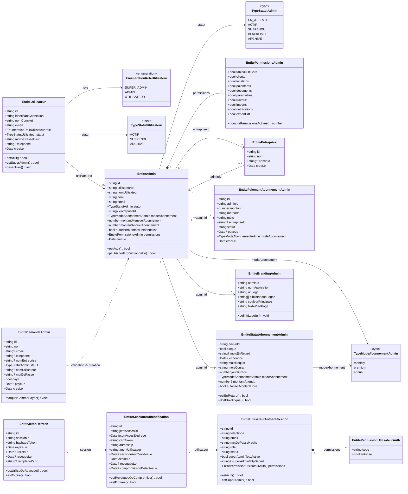
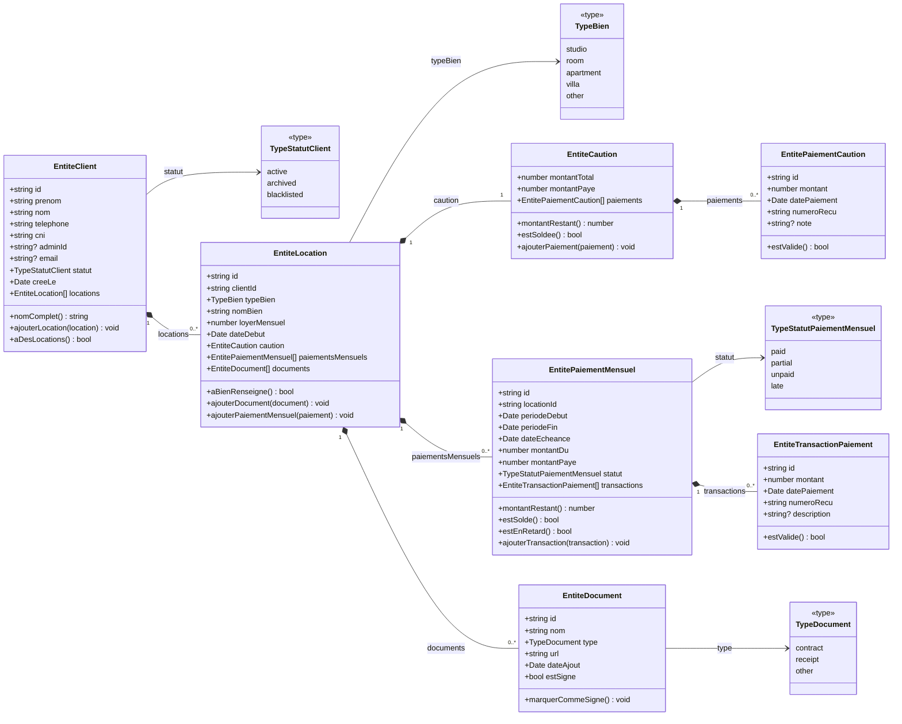

# Diagrammes Classes Admin SuperAdmin Client

Ce document formalise la representation orientee objet actuelle du backend.

Point cle de conception:
- Il n'existe pas de classe `SuperAdmin` separee.
- `SUPER_ADMIN` est une valeur de role portee par `EntiteUtilisateur.role`.
- `Admin` est une entite metier specifique (`EntiteAdmin`) liee a un utilisateur.

## 1) Diagramme classes Admin + SuperAdmin (auth + administration)

Lecture conception:
- `SUPER_ADMIN` est un role sur `EntiteUtilisateur`.
- L'entite `EntiteAdmin` encapsule les besoins metier admin (abonnement, permissions metier, branding, paiements).
- Le sous-modele authentification est separe (`EntiteUtilisateurAuthentification`, `EntiteSessionAuthentification`, `EntiteJetonRefresh`) pour isoler la securite.

## 2) Diagramme classes Client (locations/paiements/documents)

Lecture conception:
- Oui, le client a son propre diagramme de classes.
- `EntiteClient` est l'agregat principal cote location.
- Une location regroupe 3 sous-domaines: caution, paiements mensuels, documents.
